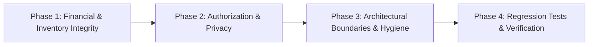

# Codebase Findings Remediation Plan

## Executive Summary

During the comprehensive `--ultra` code review of `TELEGRAM-ORDER-BOT`, four Critical and six High-severity issues were identified and validated. This implementation plan outlines four sequential, verifiable execution phases to remediate all findings, restore strict service layer boundaries, enforce Role-Based Access Control (RBAC), and eliminate financial/inventory leakage vectors.

## Roadmap Overview

- **Phase 1: Financial & Inventory Integrity** — Late topup auto-reactivation, cancelled order resurrection protection, re-entrant digital delivery, and refund reservation cleanup.
- **Phase 2: Authorization & Data Privacy** — Replace `get_current_admin` with `require_admin_role` across all mutating dashboard routes (BFLA fix); strip customer API tokens from balance serialization.
- **Phase 3: Architectural Boundaries & Operational Hygiene** — Encapsulate webhook ORM queries into service layers, redact plaintext credential logging, and unify `StateManager` singletons.
- **Phase 4: Regression Tests & Verification** — Comprehensive automated pytest suite covering all remediated failure modes, plus full ruff/mypy checks.

## Phase Index

1. [Phase 1: Financial & Payment Integrity Fixes](phase-01-financial-payment-integrity.md)
2. [Phase 2: Authorization & Data Privacy Hardening](phase-02-authorization-data-privacy.md)
3. [Phase 3: Architectural Boundaries & Operational Hygiene](phase-03-architectural-hygiene-logging.md)
4. [Phase 4: Regression Testing & Release Verification](phase-04-regression-testing-verification.md)
